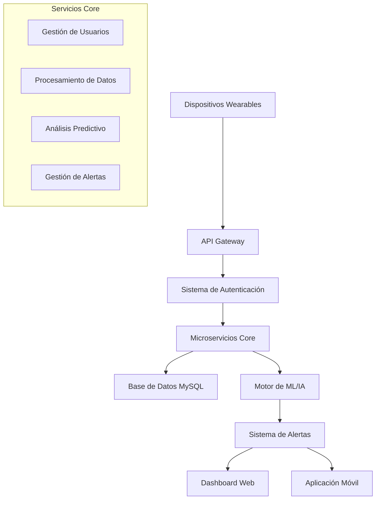

# 🏥 PredictHealth API - Sistema Inteligente de Predicción Temprana de Enfermedades Crónicas


## 📋 Tabla de Contenidos

- [Planteamiento del Problema](#-planteamiento-del-problema)
- [Objetivos](#-objetivos)
- [Justificación](#-justificación)
- [Arquitectura del Sistema](#-arquitectura-del-sistema)
- [Tecnologías Utilizadas](#-tecnologías-utilizadas)
- [Instalación y Configuración](#-instalación-y-configuración)
- [Documentación de la API](#-documentación-de-la-api)
- [Estructura de la Base de Datos](#-estructura-de-la-base-de-datos)
- [Uso del Sistema](#-uso-del-sistema)
- [Características Principales](#-características-principales)
- [Equipo de Desarrollo](#-equipo-de-desarrollo)
- [Licencia](#-licencia)

---

## 🎯 Planteamiento del Problema

### Contexto

Las **Enfermedades Crónicas No Transmisibles (ECNT)** representan la principal causa de morbimortalidad a nivel mundial, siendo responsables del 71% de todas las muertes según la OMS. En México, estas enfermedades afectan a millones de personas y representan un costo elevado para el sistema de salud pública.

### Problemática Identificada

1. **Detección Tardía**: La mayoría de enfermedades crónicas se diagnostican en etapas avanzadas cuando los tratamientos son más costosos y menos efectivos.

2. **Falta de Monitoreo Continuo**: Los pacientes solo son monitoreados durante consultas médicas esporádicas, perdiendo información valiosa sobre su estado de salud diario.

3. **Datos Fragmentados**: La información de salud está dispersa en diferentes sistemas sin integración, dificultando el análisis predictivo.

4. **Acceso Limitado a Herramientas Predictivas**: Los profesionales de la salud no cuentan con herramientas accesibles que utilicen inteligencia artificial para la predicción temprana.

### Necesidades de Información

**Para Usuarios:**
- Monitoreo continuo de signos vitales y actividad física
- Alertas tempranas sobre riesgos de salud
- Recomendaciones personalizadas de prevención
- Historial completo y accesible de sus datos de salud

**Para Profesionales de la Salud:**
- Datos consolidados y analizados de pacientes
- Alertas automáticas sobre pacientes en riesgo
- Herramientas de análisis predictivo
- Dashboard integral para toma de decisiones

**Para el Sistema de Salud:**
- Reducción de costos mediante prevención
- Optimización de recursos hospitalarios
- Datos estadísticos para políticas públicas
- Mejora en la calidad de atención

---

## 🎯 Objetivos

### Objetivo General

Desarrollar una **plataforma digital inteligente** que integre dispositivos wearables, análisis de datos clínicos y técnicas de machine learning para la **predicción temprana de enfermedades crónicas**, facilitando la prevención y el monitoreo personalizado de la salud.

### Objetivos Específicos

1. **📊 Sistema de Recolección de Datos**
   - Implementar APIs para integración con smartwatches y dispositivos wearables
   - Crear sistema de almacenamiento seguro de datos biométricos
   - Desarrollar módulos de captura de datos de actividad física y signos vitales

2. **🤖 Modelos Predictivos**
   - Implementar algoritmos de machine learning para detección de patrones
   - Desarrollar modelos específicos para diabetes, hipertensión y enfermedades cardíacas
   - Crear sistema de alertas automáticas basadas en riesgo calculado

3. **🌐 Plataforma Web Integral**
   - Diseñar dashboard interactivo para usuarios y profesionales de salud
   - Implementar sistema de autenticación seguro con Google OAuth
   - Desarrollar interfaces móviles responsivas

4. **📈 Sistema de Análisis y Reportes**
   - Generar reportes personalizados de salud
   - Crear visualizaciones de tendencias y patrones
   - Implementar sistema de recomendaciones basado en IA

5. **🔒 Seguridad y Privacidad**
   - Garantizar cumplimiento de normativas de protección de datos
   - Implementar cifrado de datos sensibles
   - Crear sistema de permisos granular

---

## 💡 Justificación

### Impacto en Salud Pública

**Prevención Temprana**: La implementación de sistemas predictivos puede reducir hasta un 30% la incidencia de complicaciones por enfermedades crónicas, según estudios de la American Heart Association.

**Reducción de Costos**: La detección temprana puede reducir los costos de tratamiento hasta en un 60%, especialmente en diabetes y enfermedades cardiovasculares.

### Justificación Tecnológica

**Análisis de Big Data**: Los dispositivos wearables generan millones de datos diariamente que, analizados correctamente, pueden revelar patrones predictivos únicos.

**Machine Learning Aplicado**: Los algoritmos de aprendizaje automático han demostrado una precisión del 85-95% en la predicción de eventos cardiovasculares cuando se alimentan con datos continuos.

**Democratización de la IA**: Hacer accesibles las herramientas de inteligencia artificial para profesionales de la salud sin conocimientos técnicos avanzados.

### Necesidad del Mercado

- **12.8 millones** de adultos mexicanos viven con diabetes
- **30.2 millones** padecen hipertensión arterial
- Solo el **25%** de pacientes con enfermedades crónicas mantiene control adecuado
- El **73%** de las muertes en México son causadas por ECNT

---

## 🏗️ Arquitectura del Sistema



### Componentes Principales

1. **API RESTful**: Construida con FastAPI para alta performance
2. **Base de Datos**: MySQL optimizada para datos de salud
3. **Autenticación**: JWT + Google OAuth 2.0
4. **Motor de IA**: TensorFlow/Keras para modelos predictivos
5. **Monitoreo**: Sistema de alertas en tiempo real
6. **Frontend**: React + TailwindCSS para interfaces modernas

---

## 🛠️ Tecnologías Utilizadas

### Backend
- **FastAPI** - Framework web moderno y rápido
- **Python 3.8+** - Lenguaje principal
- **SQLAlchemy** - ORM para base de datos
- **Pydantic** - Validación de datos
- **JWT** - Autenticación segura
- **TensorFlow/Keras** - Machine Learning
- **Pytest** - Testing automatizado

### Base de Datos
- **MySQL 8.0+** - Base de datos principal
- **Redis** - Cache y sesiones (próximamente)

### Frontend (Planificado)
- **React 18** - Librería de UI
- **TypeScript** - Tipado estático
- **TailwindCSS** - Framework CSS
- **Vite** - Build tool moderno

### DevOps & Cloud
- **Docker** - Containerización
- **AWS EC2** - Hosting de aplicación
- **AWS S3** - Almacenamiento de archivos
- **GitHub Actions** - CI/CD

### Herramientas de Desarrollo
- **Visual Studio Code** - Editor principal
- **Postman** - Testing de APIs
- **Figma** - Diseño de interfaces
- **Git/GitHub** - Control de versiones

---

## ⚙️ Instalación y Configuración

### Requisitos Previos

- Python 3.8 o superior
- MySQL 8.0 o superior
- Git
- Virtual Environment

### Instalación

1. **Clonar el repositorio:**
```bash
git clone https://github.com/tu-usuario/predict-health-api.git
cd predict-health-api
```

2. **Crear entorno virtual:**
```bash
python -m venv BackendPredictHealth
# Windows
.\BackendPredictHealth\Scripts\activate
# Linux/Mac
source BackendPredictHealth/bin/activate
```

3. **Instalar dependencias:**
```bash
pip install -r requirements.txt
```

4. **Configurar variables de entorno:**
```bash
cp .env.example .env
# Editar .env con tus configuraciones
```

5. **Configurar base de datos:**
```bash
# Crear base de datos MySQL
mysql -u root -p
CREATE DATABASE predict_health_db;
```

6. **Ejecutar migraciones:**
```bash
# Las tablas se crean automáticamente al iniciar la aplicación
```

7. **Ejecutar la aplicación:**
```bash
uvicorn app:app --reload
```

### Configuración de Gmail para Notificaciones

1. Activar verificación en 2 pasos en tu cuenta de Gmail
2. Generar contraseña de aplicación específica
3. Configurar en `.env`:
```env
EMAIL_FROM=tu-email@gmail.com
EMAIL_PASSWORD=tu-app-password-de-16-caracteres
```

---

## 📚 Documentación de la API

### Endpoints Principales

**Accede a la documentación interactiva en:** `http://localhost:8000/docs`

#### Autenticación Normal
- `POST /api/v1/auth/register` - Registro de usuario
- `POST /api/v1/auth/verify-email` - Verificación por email
- `POST /api/v1/auth/login` - Inicio de sesión
- `GET /api/v1/auth/me` - Información del usuario actual

#### Autenticación Google
- `POST /api/v1/google-auth/login` - Login/registro con Google
- `POST /api/v1/google-auth/set-password` - Establecer contraseña
- `GET /api/v1/google-auth/check-password` - Verificar contraseña

#### Gestión de Usuarios
- `GET /api/v1/users` - Lista de usuarios (ADMIN)
- `PUT /api/v1/users/{id}/deactivate` - Desactivar usuario (ADMIN)

#### Datos de Salud (Próximamente)
- `POST /api/v1/heart-measurements` - Registrar mediciones cardíacas
- `GET /api/v1/heart-measurements` - Obtener mediciones
- `POST /api/v1/physical-activity` - Registrar actividad física
- `GET /api/v1/alerts` - Obtener alertas de salud

---

## 🗃️ Estructura de la Base de Datos

### Tablas Principales

```sql
-- Personas (datos demográficos)
tbb_personas (
    ID, Nombre, Primer_Apellido, Segundo_Apellido,
    Fecha_Nacimiento, Genero, Estatus
)

-- Usuarios del sistema
tbb_usuarios (
    ID, Persona_Id, Nombre_Usuario, Correo_Electronico,
    Contrasena, Google_ID, Estatus
)

-- Roles y permisos
tbc_roles (ID, Nombre, Descripcion, Estatus)
tbd_usuarios_roles (Usuario_ID, Rol_ID, Estatus)

-- Dispositivos wearables
tbb_smartwatches (
    ID, Usuario_ID, Marca, Modelo, 
    Numero_serie, Fecha_vinculacion, Activo
)

-- Datos de salud
tbb_mediciones_cardiacas (
    ID, Usuario_ID, Smartwatch_ID, Timestamp_medicion,
    Frecuencia_cardiaca, Presion_sistolica, Saturacion_oxigeno
)

tbb_actividad_fisica (
    ID, Usuario_ID, Smartwatch_ID, Pasos,
    Distancia_km, Calorias_quemadas, Minutos_actividad
)

-- Sistema de alertas
tbb_alertas (
    ID, Usuario_ID, Tipo_alerta, Mensaje,
    Valor_detectado, Prioridad, Timestamp_alerta
)
```

### Roles del Sistema

- **ADMIN** (ID: 1) - Administrador con acceso completo
- **USUARIO** (ID: 2) - Usuario estándar con acceso a sus datos
- **MEDICO** (ID: 3) - Profesional con acceso a datos médicos

---

## 🚀 Uso del Sistema

### Para Usuarios Finales

1. **Registro**: Crear cuenta con email y contraseña o Google
2. **Verificación**: Confirmar email con código de 6 dígitos
3. **Perfil**: Completar datos personales de salud
4. **Dispositivos**: Vincular smartwatches compatibles
5. **Monitoreo**: Recibir alertas y recomendaciones personalizadas

### Para Desarrolladores

```python
# Ejemplo de uso de la API
import requests

# Registrar usuario
response = requests.post("http://localhost:8000/api/v1/auth/register", json={
    "correo_electronico": "usuario@example.com",
    "nombre_usuario": "usuario123",
    "contrasena": "password123"
})

# Verificar email
verify_response = requests.post("http://localhost:8000/api/v1/auth/verify-email", json={
    "verification_code": "123456"
})

# Usar token para requests autenticados
token = verify_response.json()["token"]["access_token"]
headers = {"Authorization": f"Bearer {token}"}

# Obtener información del usuario
user_info = requests.get("http://localhost:8000/api/v1/auth/me", headers=headers)
```

---

## ✨ Características Principales

### 🔐 Autenticación Avanzada
- ✅ Registro con verificación por email
- ✅ Login con Google OAuth 2.0
- ✅ JWT con expiración configurable
- ✅ Sistema de roles granular
- ✅ Establecimiento de contraseña para usuarios Google

### 📊 Gestión de Datos de Salud
- ✅ Integración con dispositivos wearables
- ✅ Monitoreo de signos vitales en tiempo real
- ✅ Registro de actividad física diaria
- ✅ Perfil de salud personalizado

### 🚨 Sistema de Alertas Inteligentes
- ✅ Detección de frecuencia cardíaca anormal
- ✅ Alertas de presión arterial elevada
- ✅ Recordatorios de medicamentos
- ✅ Detección de caídas
- ✅ Notificaciones de metas de ejercicio

### 📈 Análisis Predictivo (En Desarrollo)
- 🔄 Modelos de machine learning para predicción
- 🔄 Análisis de patrones de comportamiento
- 🔄 Recomendaciones personalizadas
- 🔄 Reportes de riesgo de enfermedades crónicas

### 🎨 Interfaz Moderna
- 🔄 Dashboard web responsivo (React + TailwindCSS)
- 🔄 Aplicación móvil nativa (React Native)
- 🔄 Diseño centrado en el usuario
- 🔄 Accesibilidad WCAG 2.1

---

## 👥 Equipo de Desarrollo

**Universidad Tecnológica de Xicotepec de Juárez**  
**Ingeniería en Tecnologías de la Información**

### Integrantes del Proyecto:

- **Ana Karen Crisanto Reyes** - Backend & Machine Learning
- **Martin Vargas Gutiérrez** - Frontend & UX/UI Design  
- **Jaime Vázquez Santiago** - DevOps & Database Architecture
- **Alejandro González Romero** - Mobile Development & Testing

### Docente Supervisor:
- **M.A.I.E. Héctor Valderrabano González** - Director del Proyecto

### Materias Integradas:
- **Administración de Proyectos de TI** - Gestión y planificación
- **Extracción de Conocimiento en Bases de Datos** - Machine Learning
- **Desarrollo Web Integral** - Frontend y Backend
- **Desarrollo para Dispositivos Inteligentes** - Integración IoT
- **Dirección de Equipos de Alto Rendimiento** - Liderazgo colaborativo

---

## 📈 Roadmap del Proyecto

### Fase 1: Fundación (Completado ✅)
- [x] Arquitectura base del sistema
- [x] Sistema de autenticación completo
- [x] Base de datos y modelos
- [x] API REST con FastAPI
- [x] Documentación inicial

### Fase 2: Core Features (En Progreso 🔄)
- [ ] Integración con dispositivos wearables
- [ ] Sistema de alertas en tiempo real
- [ ] Dashboard web básico
- [ ] Modelos de ML preliminares
- [ ] Testing automatizado

### Fase 3: Inteligencia Avanzada (Planificado 📅)
- [ ] Modelos predictivos avanzados
- [ ] Sistema de recomendaciones
- [ ] Análisis de patrones complejos
- [ ] Integración con APIs médicas
- [ ] Reportes analíticos

### Fase 4: Producción (Futuro 🚀)
- [ ] Aplicación móvil completa
- [ ] Despliegue en la nube
- [ ] Sistema de monitoreo
- [ ] Certificaciones de seguridad
- [ ] Escalabilidad empresarial

---

## 🤝 Contribuciones

Este proyecto es desarrollado como parte del trabajo de titulación en la Universidad Tecnológica de Xicotepec de Juárez. Para contribuciones externas:

1. Fork del repositorio
2. Crear branch para nueva feature (`git checkout -b feature/AmazingFeature`)
3. Commit de cambios (`git commit -m 'Add some AmazingFeature'`)
4. Push al branch (`git push origin feature/AmazingFeature`)
5. Crear Pull Request

---

## 📄 Licencia

Este proyecto está bajo la Licencia MIT. Ver `LICENSE.md` para más detalles.

---

## 📞 Contacto

**Equipo PredictHealth**  
Universidad Tecnológica de Xicotepec de Juárez  
📧 Email: predictHealth@utxicotepec.edu.mx  
🌐 Website: [En desarrollo]  
📱 Demo: [http://localhost:8000/docs](http://localhost:8000/docs)  

---

## 🎯 Impacto Esperado

### Social
- **Mejora en la calidad de vida** de personas con enfermedades crónicas
- **Reducción de hospitalizaciones** mediante prevención temprana
- **Democratización del acceso** a herramientas de salud inteligentes

### Tecnológico
- **Innovación en healthtech** mexicano
- **Integración de IA** en sistemas de salud públicos
- **Estándares de interoperabilidad** para dispositivos médicos

### Económico
- **Reducción de costos** en el sistema de salud
- **Creación de empleos** en el sector tecnológico
- **Atracción de inversión** en startups de salud digital

---

<div align="center">

**🏥 PredictHealth - Transformando el futuro de la salud preventiva 🏥**

[](https://www.utxicotepec.edu.mx)

</div>

# Sistema de Seeders - API PredictHealth

## Descripción General

El sistema de seeders permite poblar la base de datos con datos de prueba realistas para el desarrollo y testing de la API de salud predictiva. Incluye datos coherentes para usuarios, perfiles de salud, alertas, actividad física y mediciones cardíacas.

## Estructura del Sistema

### Seeders Disponibles (Orden de Ejecución)

1. **RoleSeeder** - Roles del sistema (ADMIN, USUARIO, MEDICO)
2. **PersonSeeder** - Personas de prueba con demografía realista
3. **UserSeeder** - Usuarios con autenticación y contraseñas hasheadas
4. **UserRoleSeeder** - Asignación de roles a usuarios
5. **SmartwatchSeeder** - Dispositivos smartwatch vinculados a usuarios
6. **HealthProfileSeeder** - Perfiles de salud médicos completos
7. **AlertsSeeder** - Alertas de salud con diferentes prioridades
8. **PhysicalActivitySeeder** - Datos de actividad física (90 días de historial)

### Archivos del Sistema

```
seeders/
├── __init__.py
├── base_seeder.py              # Clase base con funcionalidad común
├── main_seeder.py              # Orquestador principal
├── role_seeder.py              # Roles del sistema
├── person_seeder.py            # Demografía de personas
├── user_seeder.py              # Usuarios y autenticación
├── user_role_seeder.py         # Asignación de roles
├── smartwatch_seeder.py        # Dispositivos wearables
├── health_profile.py           # Perfiles médicos
├── alerts_seeder.py            # Alertas de salud
├── physical_activity_seeder.py # Actividad física
└── heart_measurement_seeder.py # Mediciones cardíacas
```

## Uso del Sistema

### 1. Ejecución Básica

```bash
# Ejecutar todos los seeders
python -m seeders.main_seeder

# Limpiar y volver a poblar
python -m seeders.main_seeder --clear

# Solo limpiar tablas sin poblar
python -m seeders.main_seeder --clear-only
```

### 2. Seeders Individuales

```bash
# Solo perfiles de salud
python -m seeders.main_seeder --health-only

# Seeder específico
python -m seeders.alerts_seeder --clear
python -m seeders.physical_activity_seeder --clear


python -m seeders.heart_measurement_seeder
```

### 3. Opciones Avanzadas

```bash
# Con confirmación para operaciones destructivas
python -m seeders.main_seeder --clear
# Preguntará: ¿Está seguro que desea continuar? (y/N)

# Limpieza completa sin confirmación adicional
python -m seeders.main_seeder --clear-only
```

# 📊 PredictHealth Data Warehouse

## 🎯 Descripción del Proyecto

El **PredictHealth Data Warehouse** es una solución de inteligencia de negocio especializada en análisis de datos de salud, diseñada para soportar la toma de decisiones médicas basadas en evidencia y el análisis predictivo de enfermedades crónicas.

## 🏗️ Arquitectura del Sistema

### Modelo Dimensional - Esquema Estrella

```
┌─────────────────┐    ┌──────────────────────┐    ┌─────────────────┐
│   DIM_USUARIO   │    │                      │    │   DIM_TIEMPO    │
│                 │    │                      │    │                 │
│ • user_key (PK) │────│                      │────│ • date_key (PK) │
│ • edad_grupo    │    │                      │    │ • fecha         │
│ • genero        │    │  FACT_MEDICIONES     │    │ • año           │
│ • categoria_riesgo   │    SALUD            │    │ • trimestre     │
└─────────────────┘    │                      │    │ • mes           │
                       │ • measurement_id (PK)│    │ • dia_semana    │
┌─────────────────┐    │ • user_key (FK)      │    └─────────────────┘
│ DIM_DISPOSITIVO │    │ • date_key (FK)      │    
│                 │    │ • device_key (FK)    │    ┌─────────────────┐
│ • device_key(PK)│────│ • condition_key (FK) │────│ DIM_CONDICION   │
│ • marca         │    │                      │    │                 │
│ • modelo        │    │ • frecuencia_cardiaca│    │ • condition_key │
│ • tipo_sensor   │    │ • presion_sistolica  │    │ • tipo_condicion│
└─────────────────┘    │ • saturacion_oxigeno │    │ • severidad     │
                       │ • pasos_diarios      │    │ • categoria     │
                       │ • calorias_quemadas  │    └─────────────────┘
                       └──────────────────────┘
```

## 🎯 Características Principales

### 📈 Análisis Multidimensional
- **Drill-down** desde población hasta paciente individual
- **Roll-up** para análisis de tendencias agregadas
- **Slice & Dice** por múltiples dimensiones simultáneamente
- **Time-series analysis** con granularidad configurable

### 🔍 KPIs de Salud Especializados
- **Índices de Riesgo Cardiovascular** calculados
- **Tasas de Adherencia** a tratamientos médicos
- **Efectividad de Alertas** tempranas
- **Evolución de Métricas** por cohortes demográficas

### ⚡ Performance Optimizado
- **Consultas <30 segundos** para datasets de 50M+ registros
- **Agregaciones pre-calculadas** para KPIs frecuentes
- **Particionamiento inteligente** por fecha y usuario
- **Indexación columnar** para análisis OLAP